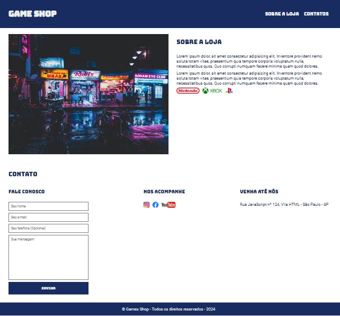

# Game Shop Project

Este é um projeto de uma loja de jogos desenvolvido utilizando apenas HTML e CSS. Ele faz parte do curso dinâmico oferecido pela EBAC (Escola Britânica de Artes Criativas e Tecnologia) de HTML e CSS.

O curso oferecido pela EBAC proporcionou uma experiência prática e imersiva, permitindo-nos explorar os fundamentos do desenvolvimento web de forma dinâmica. Aprendemos a criar layouts responsivos, estilização avançada e técnicas para melhorar a experiência do usuário, tudo isso utilizando apenas HTML e CSS.

## Sobre o Projeto

O projeto Game Shop consiste em uma loja fictícia de jogos, onde os usuários podem navegar por diferentes categorias de jogos e visualizar informações sobre cada um deles. A interface é intuitiva e amigável, proporcionando uma experiência de compra agradável.

## Visualizando o Projeto

Você pode visualizar o projeto online através do seguinte link:

[**Game Shop - Projeto EBAC**](https://projeto-one-ebac.vercel.app/)

Não deixe de conferir e explorar a loja de jogos desenvolvida durante o curso da EBAC!

---
Desenvolvido por [Seu Nome](https://github.com/seu-username)
